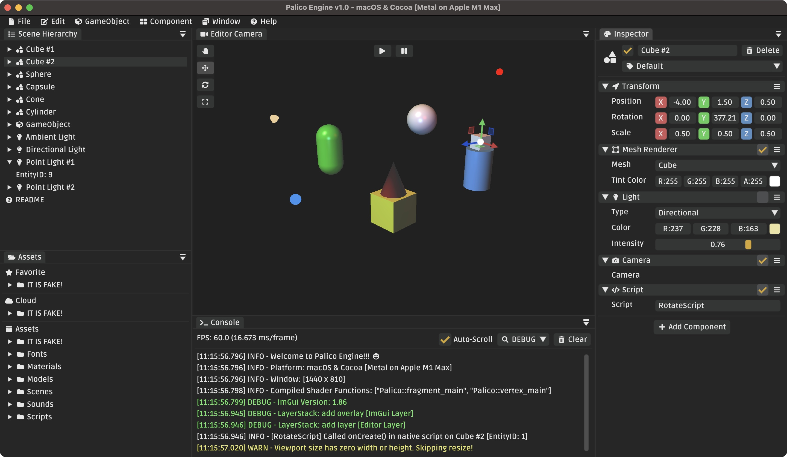

# Palico Engine: Metal-Based Game Engine in Swift 🐑

[](https://github.com/forkercat/PalicoEngine/actions/workflows/ci-macos.yml)
[](LICENSE)

[](https://swiftpackageindex.com/forkercat/PalicoEngine)
[](https://swiftpackageindex.com/forkercat/PalicoEngine)

Implement a game engine on macOS using Metal API. Still in development. Currently I am working on a more capable entity-component-system [MothECS](https://github.com/forkercat/MothECS) :)

<p align="left">
	
</p>

[Palico](https://monsterhunterworld.wiki.fextralife.com/Palicoes) - It is a cat-like combat companion in Monster Hunter!

<p align="left">
	
</p>

Palico Engine's [Sprint Board](https://forkercat.atlassian.net/jira/software/projects/PALICO/boards/1) on Jira (need permission request). Currently there are **58 issues** in total!


## 🔧 Install & Run

```sh
# Clone
git clone https://github.com/forkercat/PalicoEngine.git
cd PalicoEngine

# Compile
swift build

# Run
swift run Editor
```


## 🍻 Dependencies

```swift
dependencies: [
    .package(url: "https://github.com/forkercat/OhMyLog.git", .branch("main")),
    .package(url: "https://github.com/forkercat/MathLib.git", .branch("main")),
    .package(url: "https://github.com/forkercat/MothECS.git", .branch("main")),
    .package(url: "https://github.com/forkercat/SwiftImGui.git", .branch("update-1.86-docking")),  // forked from @ctreffs
    .package(url: "https://github.com/forkercat/SwiftImGuizmo.git", .branch("master")),  // forked from @ctreffs
],
```

Thanks to SwiftImGui by [@ctreffs](https://github.com/ctreffs) I am able to use ImGui in this application.

I forked the repository and wrapped ImGui v1.86 and added new OSX backend file. Related PRs: 
- [Update to 1.86 and update OSX backend (fix keyboard issue) #7](https://github.com/ctreffs/SwiftImGui/pull/7)
- [Update ImGui 1.86-docking #8](https://github.com/ctreffs/SwiftImGui/pull/8)


## ⭐ Features

To be added!


## 🥺 Future Development

Rendering:
- [ ] Add skybox
- [ ] Add shadow
- [ ] Support PBR
- [ ] Support deferred rendering (render pass has already been setup)

Model:
- [ ] Load 3D models
- [ ] Load textures in models
- [ ] Load animation

Other:
- [ ] Improve MothECS
- [ ] Integrate ImGuizmo
- [ ] Property/Inspector panel
- [ ] Game object selection
- [ ] Scene loading (yaml)
- [ ] Content browser (Asset Panel)


## 🙏 Reference

Started by following [game engine turotial](https://www.youtube.com/playlist?list=PLlrATfBNZ98dC-V-N3m0Go4deliWHPFwT) series by [TheCherno](https://www.youtube.com/c/TheChernoProject) and wrote implementation in C++. Also check out [Hazel Engine](https://github.com/thecherno/hazel) repository. It is a great learning resource!

- [Metal by Tutorial](https://www.raywenderlich.com/books/metal-by-tutorials/v2.0) by Caroline Begbie & Marius Horga
- ImGui on GitHub: [ocornut/imgui](https://github.com/ocornut/imgui), [cimgui/cimgui](https://github.com/cimgui/cimgui), [ctreffs/SwiftImGui](https://github.com/ctreffs/SwiftImGui)
- More to be added!
